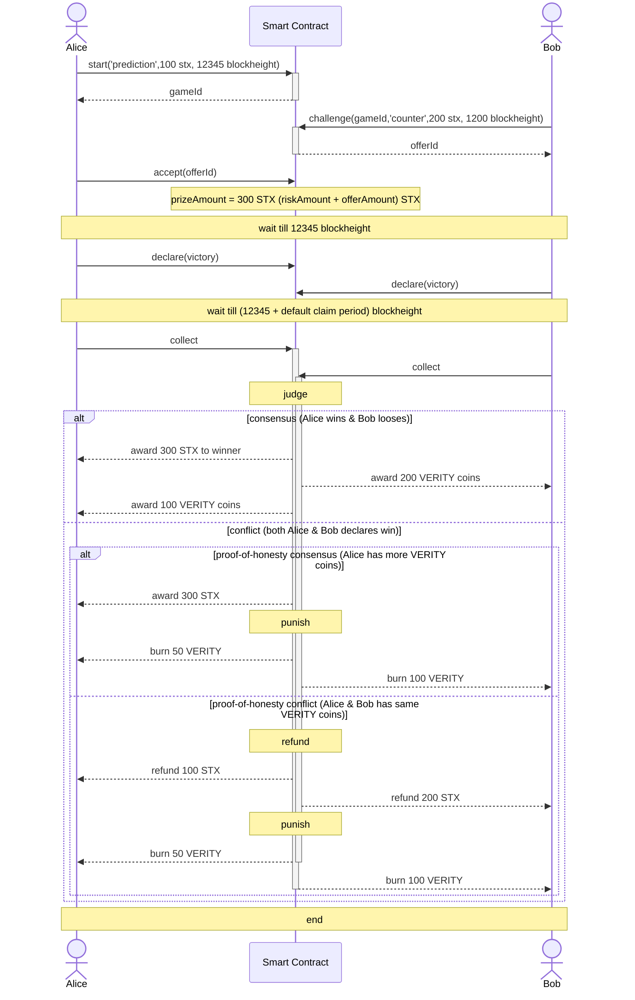

# verity.games

on-chain marketplace for making prediction stakes using Proof-of-Honesty consensus

## TL;DR Game theory whitepaper
 * Focus of today's blockchain based market is to achieve fully decentralized and trustless execution, but it typically requires a centralized trusted oracle which may have it's own side effects or trust issues. 
 * Instead of involving oracles, "verity.games" provides a smart contract based solution to simply incentivize honesty among players using VERITY coin rewards
 * players can be Honest (+1) or Cheating (-1)
   - (1,1) consensus creates best outcome for both players, where winner gets the stakes and both winner and looser gets newly minted VERITY coins based on their respective stakes
   - (1,-1) or (-1,1) conflict creates poor outcomes, where conflict is resolved using Proof-of-Honesty consensus (player with highest VERITY coins wins or they get refund of stake they have same amount of VERITY coins). Both players looses/burns 50% of their VERITY coins
 * VERITY coin's supply starts at 0, and can only be minted or burned based on game play

## Game Description :
A typical sequnce of Game play is shown in the diagram below

Alice starts the game by proposing a bet with the prediction event in description, amount of collateral in STX as risk and ending time of game by sending transaction with:
  - start(description, riskAmount, endingBlockNumber) => returns gameId

Alice can stop the game by sending transaction with:
  - stop(gameId)
  
Bob sends challenge to chosen gameId with his counter prediction in description, counter amount of collateral in STX and expiry time of offer by sending transaction with:
  - challenge(gameId, description, offerAmount, expiry) => returns offerId

Alice can accept chosen offerId by sending transaction with:
  - accept(offerId)
  bet amount of riskAmount+offerAmount is locked until end of game
  other Offers can be withdrawn after accept or after offer expiry timeout

Bob can send multiple challenges and can revoke the challange (if it is not already accepted) by sending transaction with:
  - withdraw(offerId)
  
Alice and/or Bob can declare victory after event timeout by sending transaction with:
  - declare(gameId, victory)

Alice and/or Bob can collect rewards after claim timeout by sending transaction with:
  - collect(gameId)

A judgement is made based on following state values 
* consensus state :  happens when both claims from A & B match 
  - A wins if A declares victory=true & B declares victory=false
  - B wins if B declares victory=true & A declares victory=false
  - winner gets rewarded with (riskAmount+offerAmount) amount of stx tokens
  - looser also gets rewarded with newly minted riskAmount of VERITY coins
  - winner gets rewarded with newly minted offerAmount of VERITY coins
* delayed consensus state : happens when only one of the player sends claim
  winner is chosen when second claim is sent after winTimeout 
  awards are executed according to consens state awards 
* conflict state : happens when both claims from A & B does not match
  - if both A and B sends claim with victory=true or victory=false
  - player with higher VERITY coins is chosen winner and awards are given as described in consensus state awards
  - player with lower VERITY coins is chosen looser 
  - a refund is processed for both players if they have same amout of VERITY coins
  panelty : 
   - both players loose 50% of their risk/offer amount of VERITY coins for not arriving at consensus
  
## Future improvements :
 * add NFTs/FTs as collateral along with STX
 * add players as Judges to help with consensus Proof-of-Trust? for high stake real-life event predictions
 * dao to help elect Judges
 * oracle to integrate with off-chain events as option
 * Games with more than two players: awards are split based on number of winners/loosers and their respective stakes
 * fees structure to reward Judges/devs & build treasury
